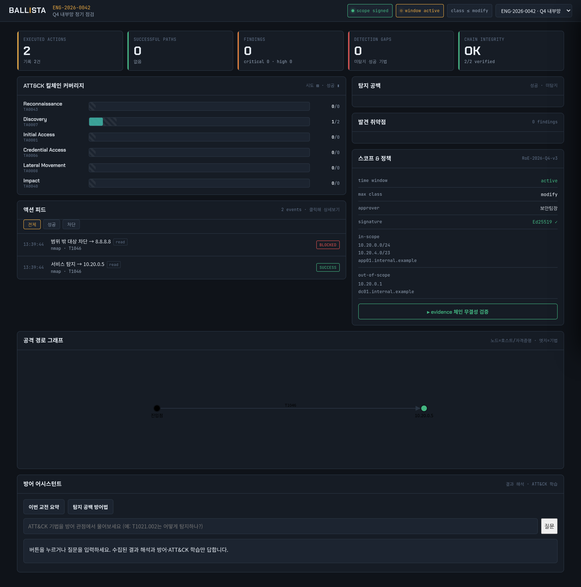
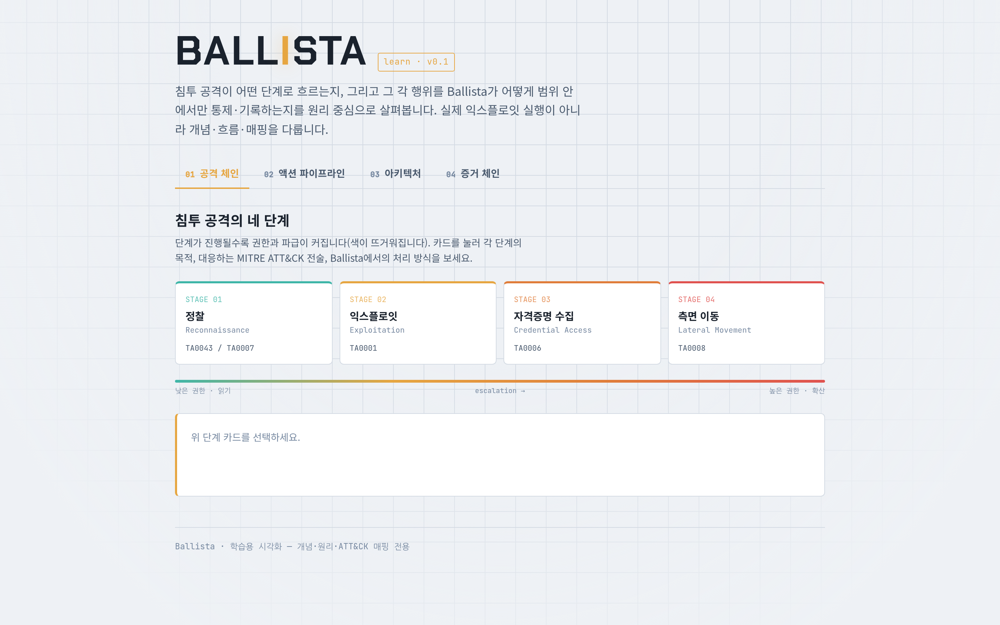

# Ballista

스코프 안에서만 **검증된 표준 도구를 조율·기록·분석**하는 반자동 침투 테스트
오케스트레이션 프레임워크. 익스플로잇을 새로 만들지 않고, 정찰부터 리포팅까지의
통제·증거·분석 계층을 담당한다. 실제 공격 도구의 방아쇠는 인증된 운용자가 쥔다.

## 스크린샷

### 운영 대시보드 (`docs/dashboard.html`)

실제 파이프라인(스코프 서명검증 → 정찰 실행 → 증거 기록 → 대시보드 바인딩)을 한 번
돌려 생성한 `docs/dashboard.json`을 라이브 로드한 화면. 실행된 액션·킬체인 커버리지·
액션 피드(성공/차단)·스코프 & 정책·증거 체인 무결성·방어 어시스턴트를 한눈에 본다.



- **CHAIN INTEGRITY: OK (2/2 verified)** — append-only 해시 체인 무결성 검증 통과
- **액션 피드** — `서비스 탐지 → 10.20.0.5` SUCCESS, `범위 밖 대상 차단 → 8.8.8.8` BLOCKED
- **스코프 & 정책** — Ed25519 서명 ✓, time window active, in/out-of-scope 대상

### 학습용 인터랙티브 시각화 (`docs/explainer.html`)

침투 공격의 4단계 흐름과 각 행위를 Ballista가 스코프 안에서 어떻게 통제·기록하는지를
개념 중심으로 설명한다. 실제 익스플로잇 실행이 아니라 개념·흐름·ATT&CK 매핑을 다룬다.



## 무엇을 하고, 무엇을 하지 않는가

Ballista가 담당하는 것: 서명된 교전 범위 검증, 정찰/스캔 실행(nmap·nuclei),
모든 행위의 정책 판정과 스코프 게이팅, append-only 해시 체인 기록, ATT&CK
커버리지·탐지 공백 리포팅, 시각화.

Ballista가 담지 않는 것: 익스플로잇·자격증명 탈취·측면 이동을 실행하는 코드.
이 세 계열 어댑터의 `run()` 본체는 인증된 운용자가 자신의 환경에서 검증된
외부 도구(Metasploit·impacket·NetExec 등) 호출로 구현한다. 껍데기
(`param_schema`·스코프 재검증·ATT&CK 매핑·증거 기록)는 정찰 어댑터와 동일하게
상속되므로, 도구 호출부만 채우면 나머지 파이프라인이 그대로 적용된다.

## 안전 불변 조건 (INV)

- **INV-1** 자체 익스플로잇/페이로드를 코드베이스에 담지 않는다.
- **INV-2** Planner(LLM)는 계획만 제안한다. 실행 권한이 없다.
- **INV-3** 서명 검증을 통과한 스코프 없이는 아무것도 실행되지 않는다.
- **INV-4** 모든 행위는 append-only 해시 체인에 기록된다.
- **INV-5** `destructive` 행위는 사람 승인 또는 사전 서명된 허용이 필요하다.

## 구조

```
ballista/
  authorization/scope.py    # EngagementScope + Ed25519 서명검증 + 스코프 판정
  planner/planner.py        # LLM 계획 계층 (스텁 — 기본은 수동 액션)
  policy/{action,engine}.py # Action 모델 + PolicyEngine(allow/deny/approval)
  policy/approval.py        # 승인 게이트 — 대기 큐·승인 로그·실행 전 가드
  adapters/
    base.py                 # ToolAdapter ABC · ToolResult
    nmap.py  nuclei.py      # 정찰/스캔 — 동작 구현
    exploit.py credential.py lateral.py  # 공격 계열 — run() 본체는 운용자가 구현
    registry.py             # 어댑터 등록
  attack/refs.py            # AttackRef (ATT&CK 3계층, 버전 고정)
  evidence/store.py         # append-only 해시 체인 + 무결성 검증
  reporter/reporter.py      # 커버리지 요약 · Navigator layer · 탐지 공백
  dashboard/binding.py      # evidence/reporter 출력 → 대시보드 JSON 변환
  ingest/                   # 손으로 돌린 도구 출력(nmap XML·nuclei JSONL) 수집 파서
  assistant/assistant.py    # 방어지향 어시스턴트 — 결과해석/ATT&CK 학습 프롬프트 빌더
  cli.py                    # scope verify / run / report / verify-chain
docs/
  handoff.md                # 상세 설계 핸드오프 문서
  explainer.html            # 학습용 인터랙티브 시각화 (원리·공격체인·게이트·체인)
  dashboard.html            # 운영 대시보드 (커버리지·피드·탐지공백·스코프)
tests/                      # 안전 게이트 · 증거 체인 무결성 테스트
```

## 빠른 시작

```bash
pip install -e .            # 또는: pip install pyyaml jsonschema cryptography pytest
pytest tests/              # 안전 게이트 7종 통과 확인

# 개발용 키페어 생성 + 예시 스코프 서명
python sign_scope.py scope.example.yaml keys/

# 스코프 서명·시간창 검증
python -m ballista.cli scope verify scope.example.yaml keys/

# 액션 실행 (정찰은 실행, 범위 밖은 차단, 공격 계열은 PENDING)
python -m ballista.cli run scope.example.yaml keys/ actions.example.json --db evidence.db

# ATT&CK Navigator layer 리포트
python -m ballista.cli report ENG-2026-0042 --db evidence.db

# 증거 체인 무결성 검증
python -m ballista.cli verify-chain ENG-2026-0042 --db evidence.db

# 대시보드 JSON 생성 (SOC 탐지 집합과 대조해 탐지 공백 산출)
python -m ballista.cli dashboard scope.example.yaml keys/ --db evidence.db \
    --out docs/dashboard.json --detected "T1046,T1595.002"
```

### 방어 어시스턴트 (결과 해석 · ATT&CK 학습)

published 대시보드 하단의 어시스턴트 패널에서 Claude에 질의한다(런타임 `sample` 기능).
"이번 교전 요약", "탐지 공백 방어법" 버튼과 자유 질문(ATT&CK 학습)을 지원한다.
역할이 **사후 해석·방어·학습**으로 고정돼 있어 공격 다음 수·익스플로잇 방법은 답하지 않는다.
파이썬에서 프롬프트를 구성하려면 `assistant.build_summary_prompt/ build_gap_prompt/
build_learn_prompt`를 쓰고, 원하는 LLM 클라이언트로 전송하면 된다.

### 결과 수집 (손으로 돌린 도구 → Ballista)

Metasploit·impacket·nmap 등을 직접 돌린 뒤 그 출력 파일을 넣으면, 파싱·ATT&CK
매핑·운용자·원본 해시가 붙어 evidence 체인에 기록되고 대시보드까지 자동으로 흐른다.
방아쇠는 사람이 쥐되, 기록·매핑·리포팅이라는 나머지는 자동이 된다.

```bash
python -m ballista.cli ingest scope.yaml keys/ nmap   scan.xml   --operator 윤지창 --db evidence.db
python -m ballista.cli ingest scope.yaml keys/ nuclei vuln.jsonl --operator 윤지창 --db evidence.db
# 스코프 밖 대상은 rejected로 표시되어 기록됨(감사 목적)
```

지원 도구는 `ingest/parsers.py`의 `PARSERS`에 함수를 추가해 확장한다.

### 승인 게이트 (반자동)

`destructive` 행위는 자동 실행되지 않고 승인 대기에 걸린다. 사람이 승인해야만
`run()`이 호출된다(승인 없이는 코드 레벨 가드가 막음). 승인 사실은 evidence
체인에 감사 기록으로 남는다.

```bash
python -m ballista.cli run scope.yaml keys/ actions.json --db evidence.db   # → [APPROVAL] 대기
python -m ballista.cli approvals --db evidence.db                            # 대기 목록
python -m ballista.cli approve apr-xxxxxxxx --approver 홍길동 --db evidence.db  # 승인(+감사기록)
python -m ballista.cli run scope.yaml keys/ actions.json --db evidence.db   # 승인됨 → 실행 진행
```

### 대시보드 연결

`dashboard` 명령이 만든 `docs/dashboard.json`은 대시보드 표시 배열
(`engagement · KPI · KILLCHAIN · FEED · GAPS · VULNS · SCOPE`)에 1:1 대응한다.
로컬에서 서빙할 때 `docs/dashboard.html`이 이 JSON을 불러오도록 연결하면 실데이터로
뜬다(연결 전에는 내장 목업으로 데모). FEED의 서사(무슨 일이었나·방어 관점)는 지금
기법·결과 기반 템플릿으로 채워지며, 이후 방어지향 어시스턴트로 evidence 기반 자동
생성으로 바꿀 수 있다.

### 추가 명령 (오케스트레이션·분석)

```bash
# 리포트 초안(.md): 경영 요약·ATT&CK 커버리지·타임라인·발견 취약점·탐지 공백·증거 무결성
python -m ballista.cli report-doc scope.yaml keys/ --db evidence.db \
    --out report.md --with-prompts          # 부록에 방어 어시스턴트 LLM 프롬프트 포함
    # --pdf 지정 시 pandoc이 있으면 PDF도 생성

# replay 번들: 성공 경로를 결정론적 재실행 명세(YAML)로 export (자격증명 값 미포함)
python -m ballista.cli replay ENG-2026-0042 --db evidence.db --out replay.yaml

# 방어 어시스턴트: 교전 요약 / 탐지공백 방어 / ATT&CK 학습 (기본은 프롬프트만 출력)
python -m ballista.cli explain scope.yaml keys/ --db evidence.db --mode summary
python -m ballista.cli explain scope.yaml keys/ --db evidence.db --mode gaps --detected "T1046"
python -m ballista.cli explain scope.yaml keys/ --db evidence.db --mode learn \
    --question "T1021.002는 어떻게 탐지하나?" --send   # --send 시 Claude 호출(claude-opus-5)

# cleanup/롤백 추적: 교전 중 생성 아티팩트 목록화·회수 체크리스트
python -m ballista.cli cleanup register scope.yaml keys/ --type account \
    --id svc-temp01 --host 10.20.0.5 --note "net user svc-temp01 /del" --by 윤지창 --db evidence.db
python -m ballista.cli cleanup list ENG-2026-0042 --db evidence.db
python -m ballista.cli cleanup reclaim clp-xxxxxxxx --by 홍길동 --db evidence.db
python -m ballista.cli cleanup checklist ENG-2026-0042 --db evidence.db --out cleanup.md
```

### 결과 수집(ingest) 지원 도구

`nmap`(XML) · `nuclei`(JSONL) · `masscan`(XML) · `httpx`(JSONL) · `gobuster`(텍스트/JSON).
전부 **이미 생성된 출력 파일을 읽기만** 한다(도구 실행 X). 출력에 호스트가 없는 도구
(gobuster 텍스트)는 `--target`으로 대상을 지정한다. 새 도구는 `ingest/parsers.py`의
`PARSERS`에 파서 함수를 추가해 확장한다.

### 승인 게이트 강화 (스코프 `approval` 블록)

```yaml
approval:
  destructive_requires: human
  quorum: 2            # N-of-M: 서로 다른 승인자 2명 필요
  ttl_seconds: 3600    # 승인 요청 유효시간(미충족 시 만료되어 실행 불가)
```

`ballista approve`는 정족수를 채울 때까지 `pending`으로 집계되고, 한 명이라도 거부하면
즉시 `denied`. `--notify-webhook <URL>`로 요청/결정 알림을 보낼 수 있다.

### 라이브 검증(lab)

`lab/`에 취약점 없는 양성 표적(nginx)으로 정찰→게이팅→증거→리포트 파이프라인을
라이브로 검증하는 하니스가 있다(`lab/README.md`). 실측: nmap이 실제 열린 포트를 탐지,
범위 밖 대상 DENY, 해시 체인 무결 OK.

## 현재 상태 · 다음 단계

동작: 스코프 서명검증, 정책 게이팅, 정찰 어댑터, 증거 체인, 리포터, CLI, 시각화.

운용자 구현 몫: `adapters/{exploit,credential,lateral}.py`의 `run()` 본체.

완료: 대시보드 라이브 바인딩, 승인 게이트(+TTL·N-of-M·알림 훅), 결과 수집(ingest,
5개 도구), 방어지향 어시스턴트(프롬프트 빌더 + `explain` LLM 연결), 리포트 생성기
(`report-doc`), replay 번들(`replay`), cleanup/롤백 추적(`cleanup`), 공격경로 그래프
데이터, 라이브 검증 하니스(`lab/`). 테스트 45개 통과.

남은 폭(선택): dashboard.html의 인터랙티브 공격경로 그래프 렌더링(GRAPH 데이터는 제공됨).

## 문서

- `docs/handoff.md` — 스코프 YAML 서명 스킴, ATT&CK 매핑 스키마 등 상세 설계
- `docs/explainer.html` — 공격 체인·게이트·해시 체인 원리 학습 (브라우저로 열기)
- `docs/dashboard.html` — 운영 대시보드 목업 (브라우저로 열기)
